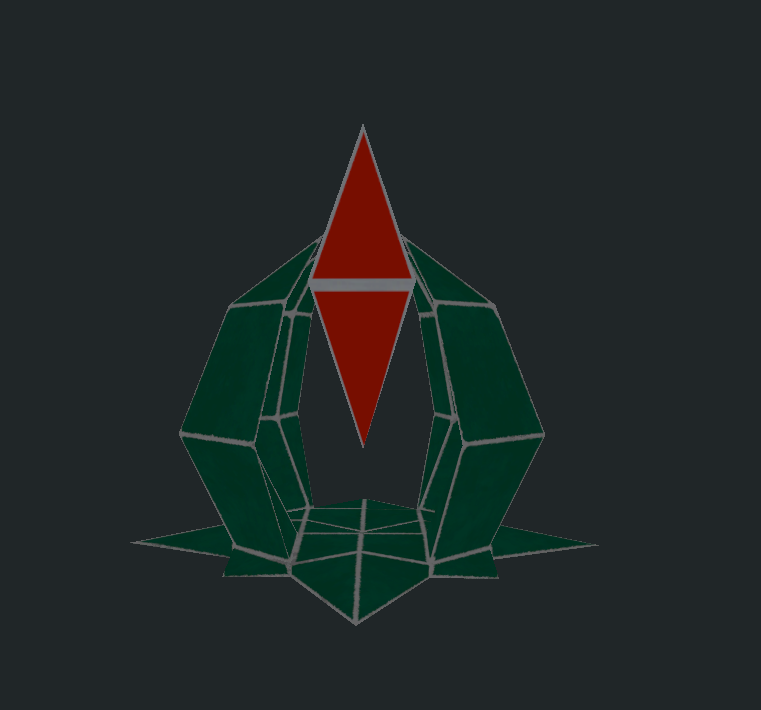
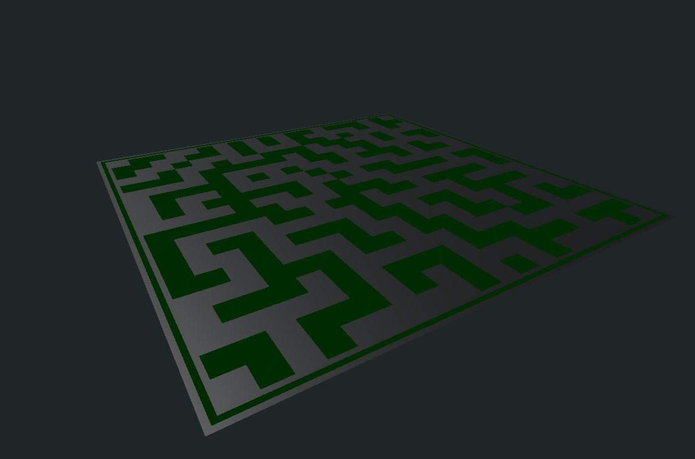
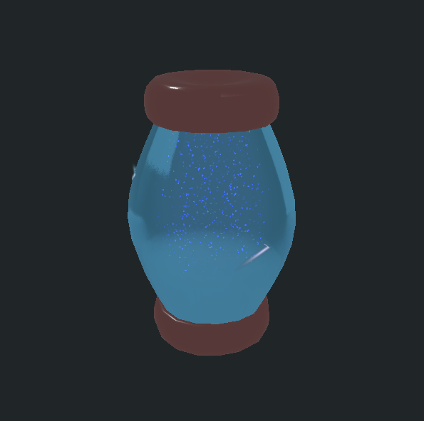

# 프로젝트명: Virus Resistance(바이러스 저항성)
---
# 목차

* [컨셉](#컨셉)
* [관련 이미지 & 동영상](#관련)
* [대표 이미지](#이미지)
* [컨셉 & 대표이미지 기반 작품묘사](#작품묘사)
* [Virus Resistance 구성 요소](#구성요소)
* [게임 시스템 디자인](#시스템디자인)
    1. [게임 오브젝트 분해](#7-1)
    2. [파라미터(속성)](#7-2)
    3. [행동](#7-3)
    4. [상태](#7-4)
    5. [플레이어 캐릭터 속성(파라미터)](#7-5)
    6. [게임의 규칙](#7-6)
* [개발 요구사항 & 흐름도](#개발요구&흐름)
    1. [요구사항](#요구사항)
    2. [입력 이벤트에 대한 흐름도](#키보드이벤트)
    3. [용어 정리](#용어정리)
* [개발작업 일정](#개발일정)

---
# 컨셉 

## 메인컨셉 :

- **방어** (다가오는 바이러스 봇들을 파괴하여 메인 코어를 지켜야 한다)

### 서브 컨셉 1 :

- **로봇** (바이러스 봇들의 종류가 다양하다)

### 서브 컨셉 2 :

- **도구** (여러 무기와 바이러스를 없애는 도구들이 있다)

### 서브 컨셉 3 :

- **스테이지** (난이도별 스테이지가 있다)

### 서브 컨셉 4 :

- **가상현실** (모든 건 가상현실 속에 들어가 방어를 한다)

### 서브 컨셉 5 :

- **웨이브** (여러 차례로 점점 강력해지는 봇들이 다가온다)

  

---

# 관련 이미지 & 동영상 

- 이미지  
     
- 동영상 
    

  

---
# 대표 이미지 

  

---
# 컨셉 & 대표이미지 기반 작품묘사 

## 대표이미지 기반 :
>게임은 가상현실에서 플레이 가능하고 목표는 바이러스 봇들로 부터 핵심 코어를 지켜야한다. 
>바이러스를 제거하면 얻는 포인트로 무기를 업그레이드, 혹은 도구를 구매가능하다. 
>여러 턴에 나오는 강력해진 적을 쓰러트리며 점수를 얻어 최고점수를 찍는 게임이다.

## 컨셉 기반:
>메인컨셉인 방어는 다가오는 바이러스 봇들을 파괴하여 메인 코어를 지켜 포인트와 점수를 얻으면 된다. 
>서브컨셉 중 로봇은 바이러스 봇들의 종류가 다양하게 나타난다. 현재로썬, 작고 빠른 드론형 봇, 보통사이즈의 근접형, 대형사이즈의 탱커형 봇,  원거리에서 공격하는 봇 등 여러 봇이 있다. 
>도구는 여러 무기와 바이러스를 없에는 도구들이 있다. EMP 탄의 경우 다가오는 적들을 일시적으로 멈추게 할 수 있다. 그리고 방패또한 설치할 수 있다. 
>스테이지는 난이도별 스테이지가 있다. 평지부터 여러 벽이 있는 곳 등등.  가상현실은 VR속에서 하는 게임이지만, 그 속에서도 가상현실로 들어가 싸우게 된다. 
>웨이브가 지날수록 더욱 강력해지는 적을 쓰러트리며, 최고 점수를 찍는 게임이 될것이다.

>

  

---
# Virus Resistance 구성 요소 
## 1. 메커니즘

### [도전 과제]

>1. 코어를 지키며 최대한 방어하여 살아남아야 한다.
>2. 도구를 이용하여 봇들의 침입을 방해해야한다.
 

### [재미 요소]

>1. 본인이 얼마나 잘 막을 수 있는가
>2. 여러 무기와 도구를 이용하여 막을수 있는가

 

## 2. 이야기

### [만들게 된 배경]  
>여러가지 게임을 생각 하던 중, VR로 만들 수 있으면서 재미있게 할 수 있는 게임이 뭐가 있을까 생각하다. 
>플레이어가 직접 목표를 디펜스를 하는 게임은 어떤가 하고 떠오르게 되었다.

 

### [참신함]
>여러 도구를 활용하여 봇들을 처치할 수 있고, 봇들의 종류도 여러 기술을 쓰는 적들이 있다. 
>그리고 브알로 직접 디펜스를 하는 게임도 그리 많지 않을 것이다.

 

### [카메라 관점]  
>본인이 바이러스 봇을 막는 백신의 시점이 된다. VR로 하는 게임이다보니 1인칭이 될것이다.

 

## 3. 미적요소

### [디자인][컬러]  
>**스테이지** : 여러곳이 막혀있어 플레이어한테 도움이 되는 맵이 있는 반면 평지로 시아가 탁 트여있지만 그만큼 적들이 올 곳도 많기에 어려운 난이도로 될 것이다. 
>**캐릭터** : 적군은 로봇으로 만들어 이 바이러스 봇은 위협적이다라는걸 느낄 수 있도록 할 것이다. 
>**컬러** : 컴퓨터 속이라는 설정과 더불어 VR에서 눈에 피로가 되지 않을선으로 색감을 잡을 것이다.

### [음향]  
>각종 무기의 소리와 여러 음향효과를 추가할 예정이다. 그리고 BGM으로는 사이버틱 하거나 8bit로 들어갈 예정이다.
 

## 4. 기술

>현재 가지고 있는 **HTC Vive Pro 2 HMD + Valve Index Controller**를 사용해 **SteamVR**을 활용한 게임을 만들것이다. 
>그리고 게임 엔진툴은 **Unity3D**, 모델링툴은 **Blender**, 텍스쳐링툴은 **Substance Painter**를 이용할 예정이다.

---
# 게임 시스템 디자인 

## 1. 게임 오브젝트 분해

|연번|오브젝트 이름|오브젝트이미지|
|------|---|---|
| 1|적||
| 2|메인 코어||
| 3|방어막||
| 4|맵||
| 5|무기| |
| 6|도구||
| 7|플레이어||

## 2. 파라미터(속성)

### 1. 적

>|속성|영문명칭|설명|비고|
>|---|---|---|---|
>|형태|eneType|적의 형태(1. 일반 2. 탱커 3. 드론)||
>|체력|eneHp|적의 형태에 따른 체력||
>|이동속도|eneSpd|적의 형태에 따른 이동속도||
>|공격력|eneAtk|적의 형태에 따른 공격력||
>|포인트|enePoint|쓰러트릴 때 얻을 랜덤 포인트 값||

### 2. 메인코어

>|속성|영문명칭|설명|비고|
>|---|---|---|---|
>|체력|mainHp|메인코어의 체력||

### 3. 방어막

>|속성|영문명칭|설명|비고|
>|---|---|---|---|
>|체력|sheildHp|방패막의 체력||

### 4. 맵

>|속성|영문명칭|설명|비고|
>|---|---|---|---|
>|시간|gameTotalTime|총 게임 플레이 시간||
>|턴|gameTurn|게임 플레이 중 턴을 누적||
>|스폰포인트|eneSpawnPoint|적들의 소환 위치||

### 5. 무기

>|속성|영문명칭|설명|비고|
>|---|---|---|---|
>|종류|weaponType|무기의 종류 (1. 근접형 2. 권총형 3. 소총형 4. 미니건)||
>|공격력|weaponAtk|무기의 형태에 따른 공격력||
>|총알 갯수|weaponBulCnt|무기의 형태에 따른 총알 갯수||

### 6. 도구

>|속성|영문명칭|설명|비고|
>|---|---|---|---|
>|종류|toolType|도구의 종류||
>|지속 시간|toolTotalTime|도구마다 있는 효과의 지속시간||
>|공격력|toolAtk|도구에 있는 공격력||
>|수량|toolCnt|플레이어 본인이 가지고 있는 도구의 수량||

---
## 3. 행동 

### 1. 적

>|행동|설명|
>|---|---|
>|이동|설정된 속도에 따라 메인코어를 향해 이동|
>|공격|메인코어로 가는 중에 플레이어가 공격 혹은 메인코어가 공격범위 내에 있을 때 공격|
>|사망|체력이 0이 되어 사망|
>|기절|도구로 인해 이상상태가 되었을 때 기절|
>|체력 감소|플레이어가 공격을 하였을 때 받는 데미지|

### 2. 메인코어

>|행동|설명|
>|---|---|
>|체력 감소|적들로부터 받는 공격으로 인하여 얻는 데미지|
>|파괴|체력이 0이 되어 파괴되고 게임이 종료|

### 3. 방어막

>|행동|설명|
>|---|---|
>|전개|방어막이 설치되어 전개|
>|체력 감소|적들로부터 받는 공격으로 인하여 얻는 데미지|
>|파괴|체력이 0이 되어 파괴|
>|해제|플레이어가 설치된 방어막을 해제|

### 4. 맵

>|행동|설명|
>|---	|---    |
>|웨이브 추가|웨이브가 끝날 때마다 1씩 추가|
>|적 스폰|웨이브가 시작될 때, 설정된 적 개수만큼 소환|

### 5. 무기

>|행동|설명|
>|---|---|
>|발사|총알을 발사 (총알 개수가 부족하면 발사되지 않는다)|
>|재장전|총탄을 재장전|

### 6. 도구

>|행동|설명|
>|---|---|
>|사용|도구의 기술을 사용|
>|도구 충전|도구를 얻을 때 추가|

### 7. 플레이어

>|행동|설명|
>|---|---|
>|이동|설정된 이동속도에 따라 이동|
>|체력 감소|적들로부터 받는 공격으로 인하여 얻는 데미지|
>|도구 사용|보유하고 있는 도구를 사용|
>|무기 사용|들고있는 무기를 사용|

---
## 4.상태 

### 1. 적

>|현상태|전이상태|전이조건|
>|---|---|---|
>|소환|대기|초반 적이 소환될 때|
>|대기|이동|메인코어로 목표 설정될 때|
>|대기|기절|소환되고 EMP도구를 맞을 때|
>|대기|사망|소환되고 체력이 0이 되었을 때|
>|이동|공격|이동 중 플레이어로부터 공격을 받거나 메인코어가 공격 범위 안에 들어올 때|
>|이동|기절|이동 중 EMP 도구를 맞을 때|
>|이동|사망|이동 중 체력이 0이 되었을 때|
>|공격|기절|공격 중 EMP 도구를 맞을 때|
>|공격|사망|공격 중 체력이 0이 되었을 때|
>|기절|대기|EMP 도구의 지속사건이 끝났을 때|
>|기절|사망|기절 중 체력이 0이 되었을 때|

### 2. 메인코어, 방어막

>|현상태|전이상태|전이조건|
>|---|---|---|
>|기본|기본|기본적인 상태일 때|
>|기본|데미지|공격을 받았을 때|
>|데미지|파괴|공격을 받고 체력이 0이 되었을 때|

### 3. 맵

>|현상태|전이상태|전이조건|
>|---|---|---|
>|시작|기본|초기 시작하고 플레이어 소환하고 웨이브1 시작|
>|기본|휴식|적들이 전멸할 때|
>|휴식|소환|휴식 시간이 끝날 때|
>|소환|기본|해당 웨이브마다 설정된 적이 소환 다 되고 게임을 시작할 때|
>|기본|종료|메인 코어가 파괴되어 게임을 종료할 때|

### 4. 무기

>|현상태|전이상태|전이조건|
>|---|---|---|
>|대기|대기|가만히 있을 때|
>|대기|발사|플레이어가 트리거를 눌러 발사를 시작할 때|
>|발사|대기|플레이어가 트리거를 뗄 때 |
>|발사|재장전 필요|총기의 탄약이 없을 때|
>|대기|재장전|플레이어가 재장전을 할 때|

### 5. 도구

>|현상태|전이상태|전이조건|
>|---|---|---|
>|대기|대기|가만히 있을 때|
>|대기|사용|플레이어가 도구를 들고 사용을 하였을 때|
>|사용|대기|플레이어가 도구의 사용을 완료하였을 때|
>|대기|사용 불가|도구의 개수가 0일 때|

### 6. 플레이어

>|현상태|전이상태|전이조건|
>|---|---|---|
>|대기|대기|가만히 있을 때|
>|대기|이동|플레이어가 이동을 할 때|
>|이동|대기|플레이어가 이동을 끝냈을 때|

---

## 5. 플레이어 캐릭터 속성(파라미터)

>|속성|영문명칭|설명|비고|
>|---|---|---|---|
>|체력|playerHp|플레이어의 체력|   	|
>|속도|playereSpd|플레이어의 속도|   	|
>|도구 목록|playerToolList|플레이어가 가지고 있는 도구의 목록|   	|
>|무기 목록|playerWeaponList|플레이어가 가지고 있는 무기의 목록|   	|

---

## 6. 게임의 규칙

다가오는 적들로부터 메인코어가 파괴되지 않도록 플레이어가 모든 도구와 무기를 써서 지키면 된다.

---
# 개발 요구사항 & 흐름도 

## 요구사항 

\- 메인(그래픽)
>1. 화면은 시작화면, 게임화면, 점수화면 총 3가지가 있다.
>2. 시작화면에는 시작과 종료버튼이 있고 사운드를 조절할 수 있는 바가 있다.
>3. 시작화면에서 왼쪽에는 총 점수 순위가 있다.

\- 메인(프로그래밍)
>4. 종료버튼을 누르면 게임이 종료된다.
>5. 사운드 바를 좌우로 움직이면 모든 음량을 조절할 수 있다.
>6. 시작하기를 누르면 게임화면으로 넘어가게된다.

\- 플레이어(그래픽)
>7. 게임화면에서 오른쪽 팔에 플레이어의 체력 게이지, 메인코어 체력 게이지, 플레이어의 포인트 텍스트가 있다.
>8. 캐릭터는 헬멧을 쓴 사람으로 한다.

\- 플레이어(프로그래밍)
>9. 왼손 조이스틱을 이용하여 이동 가능하다.
>10. 오른손 조이스틱을 이용하여 시야를 움직일 수 있다.
>11. 트리거를 이용하여 사용을 할 수 있다.(총기는 발사, 도구는 사용, 화면에선 선택)
>12. 그립버튼을 이용하여 물체를 잡을 수 있다.
>13. B버튼을 누르면 메뉴창이 나온다.

\- 게임(그래픽)
>14. 메인코어 옆면엔 조작이 가능한 모니터가 있고, 모니터에는 상점과 업그레이드 버튼이 있다.
>15. 맵은 평지와 미로형태의 맵이 있고 중앙에는 메인코어(빛나는 수정이 떠있는 모양)가 있다.
>16. 봇들은 일반봇, 탱커봇, 드론봇이 있다.

\- 게임(프로그래밍)
>17. 게임화면에서 메인코어에 웨이브 시작까지 남은 시간 텍스트, 스톱워치 텍스트, 메인코어 체력바, 지금까지의 웨이브가 표시된다.
>18. 웨이브 대기 시간은 20초이다.
>19. 웨이브 시작까지 남은 시간이 0이 되면 웨이브는 1 증가하고 스톱워치는 시작된다.
>20. 웨이브가 시작되면 맵 가장자리에 지정된 위치에 랜덤적으로 봇들이 소환된다.
>21. 일반봇은 1턴마다 5마리씩 늘어난다.
>22. 드론봇은 3턴마다 3마리씩 생성된다.(3, 6, 9,...)
>23. 탱커봇은 5턴마다 1마리씩 생성된다.(5, 10, 15,...)
>24. 맵에 봇들이 더이상 없는 경우 스톱워치는 중단되고, 웨이브 시작시간까지 남은 시간이 흘러간다.
>25. 플레이어 체력이 0이하가 되면, 5초의 대기시간동안 눈앞은 흑백이 되고 아무것도 못한다.
>26. 메인코어 체력이 0이하가 되면 점수화면으로 넘어가 게임은 끝난다.

\- 적(그래픽)
>27. 일반봇은 칼이 손에 있는 근첩형 로봇이다.
>28. 드론봇은 프로펠러가 1개 내장되었고, 소형 총이 탑재된 드론형태의 로봇이다.
>29. 탱커봇은 플레이어보다 2배크며 미니건같은 총구가 손에 장착되 있는 로봇이다.

\- 적(프로그래밍)
>30. 봇들은 메인코어에 우선순위를 두어 이동한다.
>31. 봇들은 플레이어로부터 공격을 받을 시 우선순위를 변경한다.
>32. 봇들은 인식 범위 안에 있어야 공격을 시작한다.
>33. 일반봇은 근처에서 5의 데미지를 주며 100의 체력을 가지고 있다.
>34. 일반봇은 메인코어에 3의 데미지를 줄 수 있다
>35. 드론봇은 근처에서 2의 데미지를 주며 25의 체력을 가지고 있다.
>36. 드론봇은 메인코어에 1의 데미지를 줄 수 있다.
>37. 탱커봇은 중거리에서 7의 데미지를 주며 200의 체력을 가지고 있다.
>38. 탱커봇은 메인코어에 5의 데미지를 줄 수 있다.

\- 점수(그래픽)
>39. 점수를 나타내는 텍스트랑 메인 메뉴로 돌아가는 버튼이 있다.

\- 점수(프로그래밍)
>40. 게임이 끝나고 합산된 점수를 표시해준다.

\- 상점(그래픽)
>41. 상점버튼을 누르면 무기와 도구에 대한 버튼들이 좌우구역으로 나눠져 있다.
>42. 각 버튼에는 해당 아이템에 대한 아이콘이 표시되 있다.
>43. 무기는 근접형, 권총형, 돌격소총형, 미니건이 있다.
>44. 도구는 EMP수류탄, 힐킷, 설치형 방패막, 지뢰가 있다.

\- 상점(프로그래밍)
>45. 각 버튼을 누르면 해당 아이템을 구매할 수 있다.

\- 무기(그래픽)
>46. 근첩형은 야구배트처럼 생겼다.
>47. 권총형은 미래형이다.
>48. 돌격소총형은 Vector형태로 미래형이다.
>49. 미니건형은 미니건형태의 레이저총이다.

\- 무기(프로그래밍)
>50. 근첩형은 한번 휘두르면 50의 데미지와 크리티컬로 총 75데미지가 들어간다.
>51. 권총형은 한발당 20의 데미지와 한탄창당 15발, 총 10탄창이 주어진다.
>52. 돌격소총형은 한발당 30데미지와 한 탄창당 30발, 총 5탄창이 주어진다.
>53. 미니건형은 한발당 40데미지와 한번에 100발, 총 200발을 쏠 수 있다.
>54. 총기류는 총기 옆에 홀로그램 형식 텍스트로 남은 탄창이 적혀있다.

\- 도구(그래픽)
>55. EMP 수류탄은 수류탄 모양에 안전핀, 트리거가 있다.
>56. 힐킷은 주사기형태에 초록 액체가 담겨있다.
>57. 설치형 방패막은 조금 넓은 범위의 전자막모양이다.
>58. 지뢰는 네모난 형태의 C4같은 하고있다.

\- 도구(프로그래밍)
>59. EMP 수류탄의 안전핀을 뽑고 트리거를 누르면 5초의 타이머가 시작된다.
>60. EMP 수류탄이 5초가 지난후 터지면 주변 로봇들은 다 비활성화(기절상태)가 된다.
>61. 힐킷을 들고 몸에 바늘쪽을 찌르고 트리거를 누르면 25의 체력이 회복된다.
>62. 방패막은 플레이어의 총탄, 플레이어는 통과 가능하지만, 봇은 통과가 불가능하다.
>63. 방패막은 총 30의 체력이 지니고 있다.
>64. 방패막은 드론봇은 피해가지만, 일반봇과 탱커봇은 공격을 해 파괴한다.
>65. 지뢰는 바닥과 벽면에 설치가 가능하다.
>66. 지뢰를 벽에 설치하면 레이저가 보이며 그 범위에 닿으면 폭발한다.
>67. 지뢰는 100의 데미지를 준다.

---
## 컨트롤러 이벤트에 대한 흐름도 

---
## 용어정리 

---
# 개발작업 일정 

