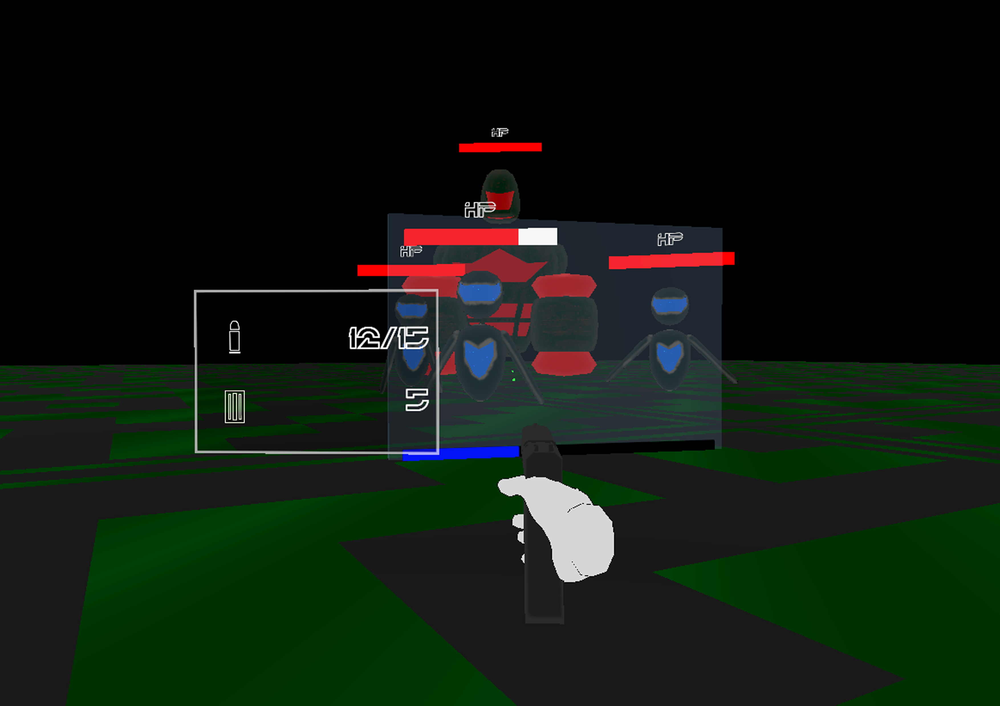

# 프로젝트명: Virus Resistance(바이러스 저항성)
---
# 목차

* [컨셉](#컨셉)
* [관련 이미지 & 동영상](#관련)
* [대표 이미지](#이미지)
* [컨셉 & 대표이미지 기반 작품묘사](#작품묘사)
* [Virus Resistance 구성 요소](#구성요소)
    1. [매커니즘](#매커니즘)
    2. [이야기](#이야기)
    3. [미적요소](#미적요소)
    4. [기술](#기술)
* [게임 시스템 디자인](#시스템디자인)
* [개발 요구사항 & 흐름도](#개발요구&흐름)
    1. [요구사항](#요구사항)
    2. [키보드 이벤트에 대한 흐름도](#키보드이벤트)
    3. [용어 정리](#용어정리)
* [개발작업 일정](#개발일정)

---
# 컨셉 

## 메인컨셉 :

- **방어** (다가오는 바이러스 봇들을 파괴하여 메인 코어를 지켜야 한다)

### 서브 컨셉 1 :

- **로봇** (바이러스 봇들의 종류가 다양하다)

### 서브 컨셉 2 :

- **도구** (여러 무기와 바이러스를 없애는 도구들이 있다)

### 서브 컨셉 3 :

- **스테이지** (난이도별 스테이지가 있다)

### 서브 컨셉 4 :

- **가상현실** (모든 건 가상현실 속에 들어가 방어를 한다)

### 서브 컨셉 5 :

- **웨이브** (여러 차례로 점점 강력해지는 봇들이 다가온다)

  

---

# 관련 이미지 & 동영상 

- 이미지  
     
- 동영상 
    

  

---
# 대표 이미지 

  

---
# 컨셉 & 대표이미지 기반 작품묘사 

## 대표이미지 기반 :
>게임은 가상현실에서 플레이 가능하고 목표는 바이러스 봇들로 부터 핵심 코어를 지켜야한다. 
>바이러스를 제거하면 얻는 포인트로 무기를 업그레이드, 혹은 도구를 구매가능하다. 
>여러 턴에 나오는 강력해진 적을 쓰러트리며 점수를 얻어 최고점수를 찍는 게임이다.

## 컨셉 기반:
>메인컨셉인 방어는 다가오는 바이러스 봇들을 파괴하여 메인 코어를 지켜 포인트와 점수를 얻으면 된다. 
>서브컨셉 중 로봇은 바이러스 봇들의 종류가 다양하게 나타난다. 현재로썬, 작고 빠른 드론형 봇, 보통사이즈의 근접형, 대형사이즈의 탱커형 봇,  원거리에서 공격하는 봇 등 여러 봇이 있다. 
>도구는 여러 무기와 바이러스를 없에는 도구들이 있다. EMP 탄의 경우 다가오는 적들을 일시적으로 멈추게 할 수 있다. 그리고 방패또한 설치할 수 있다. 
>스테이지는 난이도별 스테이지가 있다. 평지부터 여러 벽이 있는 곳 등등.  가상현실은 VR속에서 하는 게임이지만, 그 속에서도 가상현실로 들어가 싸우게 된다. 
>웨이브가 지날수록 더욱 강력해지는 적을 쓰러트리며, 최고 점수를 찍는 게임이 될것이다.

>

  

---
# Virus Resistance 구성 요소 
## 1. 메커니즘 

### [도전 과제]

>1. 코어를 지키며 최대한 방어하여 살아남아야 한다.
>2. 도구를 이용하여 봇들의 침입을 방해해야한다.
 

### [재미 요소]

>1. 본인이 얼마나 잘 막을 수 있는가
>2. 여러 무기와 도구를 이용하여 막을수 있는가

 

## 2. 이야기 

### [만들게 된 배경]  
>여러가지 게임을 생각 하던 중, VR로 만들 수 있으면서 재미있게 할 수 있는 게임이 뭐가 있을까 생각하다. 
>플레이어가 직접 목표를 디펜스를 하는 게임은 어떤가 하고 떠오르게 되었다.

 

### [참신함]
>여러 도구를 활용하여 봇들을 처치할 수 있고, 봇들의 종류도 여러 기술을 쓰는 적들이 있다. 
>그리고 브알로 직접 디펜스를 하는 게임도 그리 많지 않을 것이다.

 

### [카메라 관점]  
>본인이 바이러스 봇을 막는 백신의 시점이 된다. VR로 하는 게임이다보니 1인칭이 될것이다.

 

## 3. 미적요소 

### [디자인][컬러]  
>**스테이지** : 여러곳이 막혀있어 플레이어한테 도움이 되는 맵이 있는 반면 평지로 시아가 탁 트여있지만 그만큼 적들이 올 곳도 많기에 어려운 난이도로 될 것이다. 
>**캐릭터** : 적군은 로봇으로 만들어 이 바이러스 봇은 위협적이다라는걸 느낄 수 있도록 할 것이다. 
>**컬러** : 컴퓨터 속이라는 설정과 더불어 VR에서 눈에 피로가 되지 않을선으로 색감을 잡을 것이다.

### [음향]  
>각종 무기의 소리와 여러 음향효과를 추가할 예정이다. 그리고 BGM으로는 사이버틱 하거나 8bit로 들어갈 예정이다.
 

## 4. 기술 

>현재 가지고 있는 **HTC Vive Pro 2 HMD + Valve Index Controller**를 사용해 **SteamVR**을 활용한 게임을 만들것이다. 
>그리고 게임 엔진툴은 **Unity3D**, 모델링툴은 **Blender**, 텍스쳐링툴은 **Substance Painter**를 이용할 예정이다.

---
# 게임 시스템 디자인 

ㅁ

---
# 개발 요구사항 & 흐름도 

## 요구사항 

\- 메인(그래픽)
>1. 화면은 시작화면, 게임화면, 점수화면 총 3가지가 있다.
>2. 시작화면에는 시작과 종료버튼이 있고 사운드를 조절할 수 있는 바가 있다.
>3. 시작화면에서 왼쪽에는 총 점수 순위가 있다.

\- 메인(프로그래밍)
>1. 종료버튼을 누르면 게임이 종료된다.
>1. 사운드 바를 좌우로 움직이면 모든 음량을 조절할 수 있다.
>1. 시작하기를 누르면 게임화면으로 넘어가게된다.

\- 게임(그래픽)
>1. 게임화면에서 오른쪽 팔에 플레이어의 체력 게이지, 메인코어 체력 게이지, 플레이어의 포인트 텍스트가 있다.
>1. 맵은 평지와 미로형태의 맵이 있고 중앙에는 메인코어(빛나는 수정이 떠있는 모양).
>1. 봇들은 일반봇, 탱커봇, 드론봇이 있다.
>1. 메인코어 옆면엔 조작이 가능한 모니터가 있고, 모니터에는 상점과 업그레이드 버튼이 있다.

\- 게임(프로그래밍)
>1. 게임화면에서 메인코어에 웨이브 시작까지 남은 시간 텍스트, 스톱워치 텍스트, 메인코어 체력바, 지금까지의 웨이브가 표시된다.
>1. 왼손 조이스틱을 이용하여 이동 가능하다.
>1. 오른손 조이스틱을 이용하여 시야를 움직일 수 있다.
>1. 트리거를 이용하여 사용을 할 수 있다.(총기는 발사, 도구는 사용, 화면에선 선택)
>1. 그립버튼을 이용하여 물체를 잡을 수 있다.
>1. B버튼을 누르면 메뉴창이 나온다.
>1. 총기류는 총기 옆에 홀로그램 형식 텍스트로 남은 탄창이 적혀있다.
>1. 웨이브 대기 시간은 20초이다.
>1. 웨이브 시작까지 남은 시간이 0이 되면 웨이브는 1 증가하고 스톱워치는 시작된다.
>1. 웨이브가 시작되면 맵 가장자리에 지정된 위치에 랜덤적으로 봇들이 소환된다.
>1. 일반봇은 1턴마다 5마리씩 늘어난다.
>1. 드론봇은 3턴마다 3마리씩 생성된다.(3, 6, 9,...)
>1. 탱커봇은 5턴마다 1마리씩 생성된다.(5, 10, 15,...)
>1. 맵에 봇들이 더이상 없는 경우 스톱워치는 중단되고, 웨이브 시작시간까지 남은 시간이 흘러간다.
>1. 플레이어 체력이 0이하가 되면, 5초의 대기시간동안 눈앞은 흑백이 되고 아무것도 못한다.
>1. 메인코어 체력이 0이하가 되면 점수화면으로 넘어가 게임은 끝난다.

\- 점수(그래픽)
>1. 점수를 나타내는 텍스트랑 메인 메뉴로 돌아가는 버튼이 있다.

\- 점수(프로그래밍)
>1. 게임이 끝나고 합산된 점수를 표시해준다.

\- 상점(그래픽)
>1. 상점버튼을 누르면 무기와 도구에 대한 버튼들이 좌우구역으로 나눠져 있다.
>1. 각 버튼에는 해당 아이템에 대한 아이콘이 표시되 있다.
>1. 무기는 근접형, 권총형, 돌격소총형, 미니건이 있다.
>1. 도구는 EMP수류탄, 힐킷, 설치형 방패막, 지뢰가 있다.

\- 상점(프로그래밍)
>1. 각 버튼을 누르면 해당 아이템을 구매할 수 있다.

\- 무기(그래픽)
>1. 근첩형은 야구배트처럼 생겼다.
>1. 권총형은 미래형이다.
>1. 돌격소총형은 Vector형태로 미래형이다.
>1. 미니건형은 미니건형태의 레이저총이다.

\- 무기(프로그래밍)
>1. 근첩형은 한번 휘두르면 50의 데미지와 크리티컬로 총 75데미지가 들어간다.
>1. 권총형은 한발당 20의 데미지와 한탄창당 15발, 총 10탄창이 주어진다.
>1. 돌격소총형은 한발당 30데미지와 한 탄창당 30발, 총 5탄창이 주어진다.
>1. 미니건형은 한발당 40데미지와 한번에 100발, 총 200발을 쏠 수 있다.

\- 도구(그래픽)
>1. EMP 수류탄은 수류탄 모양에 안전핀, 트리거가 있다.
>1. 힐킷은 주사기형태에 초록 액체가 담겨있다.
>1. 설치형 방패막은 조금 넓은 범위의 전자막모양이다.
>1. 지뢰는 네모난 형태의 C4같은 하고있다.

\- 도구(프로그래밍)
>1. EMP 수류탄의 안전핀을 뽑고 트리거를 누르면 5초의 타이머가 시작된다.
>1. EMP 수류탄이 5초가 지난후 터지면 주변 로봇들은 다 비활성화(기절상태)가 된다.
>1. 힐킷을 들고 몸에 바늘쪽을 찌르고 트리거를 누르면 25의 체력이 회복된다.
>1. 방패막은 플레이어의 총탄, 플레이어는 통과 가능하지만, 봇은 통과가 불가능하다.
>1. 방패막은 총 30의 체력이 지니고 있다.
>1. 방패막은 드론봇은 피해가지만, 일반봇과 탱커봇은 공격을 해 파괴한다.
>1. 지뢰는 바닥과 벽면에 설치가 가능하다.
>1. 지뢰를 벽에 설치하면 레이저가 보이며 그 범위에 닿으면 폭발한다.
>1. 지뢰는 100의 데미지를 준다.

<!--

\- 메인
>* 화면은 시작화면, 게임화면, 점수화면 총 3가지가 있다.
>* 시작화면에는 시작과 종료버튼이 있고 사운드를 조절할 수 있는 바가 있다.
>* 시작화면에서 왼쪽에는 총 점수 순위가 있다.
>* 종료버튼을 누르면 게임이 종료된다.
>* 사운드 바를 좌우로 움직이면 모든 음량을 조절할 수 있다.
>* 시작하기를 누르면 게임화면으로 넘어가게된다.

\- 게임
>* 게임화면에서 오른쪽 팔에 플레이어의 체력 게이지, 메인코어 체력 게이지, 플레이어의 포인트 텍스트기 있다.
>* 게임화면에서 메인코어에 웨이브 시작까지 남은 시간 텍스트, 스톱워치 텍스트, 메인코어 체력바, 지금까지의 웨이브가 표시된다.
>* 왼손 조이스틱을 이용하여 이동 가능하다.
>* 오른손 조이스틱을 이용하여 시야를 움직일 수 있다.
>* 트리거를 이용하여 사용을 할 수 있다.(총기는 발사, 도구는 사용, 화면에선 선택)
>* 그립버튼을 이용하여 물체를 잡을 수 있다.
>* B버튼을 누르면 메뉴창이 나온다.
>* 메인코어 옆면엔 조작이 가능한 모니터가 있고, 모니터에는 상점과 업그레이드 버튼이 있다.
>* 총기류는 총기 옆에 홀로그램 형식 텍스트로 남은 탄창이 적혀있다.
>* 웨이브 대기 시간은 20초이다.
>* 웨이브 시작까지 남은 시간이 0이 되면 웨이브는 1 증가하고 스톱워치는 시작된다.
>* 웨이브가 시작되면 맵 가장자리에 지정된 위치에 랜덤적으로 봇들이 소환된다.
>* 봇들은 일반봇, 탱커봇, 드론봇이 있다.
>* 일반봇은 1턴마다 5마리씩 늘어난다.
>* 드론봇은 3턴마다 3마리씩 생성된다.(3, 6, 9,...)
>* 탱커봇은 5턴마다 1마리씩 생성된다.(5, 10, 15,...)
>* 맵에 봇들이 더이상 없는 경우 스톱워치는 중단되고, 웨이브 시작시간까지 남은 시간이 흘러간다.
>* 플레이어 체력이 0이하가 되면, 5초의 대기시간동안 눈앞은 흑백이 되고 아무것도 못한다.
>* 메인코어 체력이 0이하가 되면 점수화면으로 넘어가 게임은 끝난다.

\- 점수
>* 게임이 끝나고 합산된 점수를 표시해준다.

\- 상점
>* 상점버튼을 누르면 무기와 도구에 대한 버튼들이 좌우구역으로 나눠져 있다.
>* 각 버튼에는 해당 아이템에 대한 아이콘이 표시되 있다.
>* 무기는 근접형, 권총형, 돌격소총형, 미니건이 있다.
>* 도구는 EMP수류탄, 힐킷, 설치형 방패막, 지뢰가 있다.
>* 

\- 무기
>* 근첩형은 야구배트처럼 생겼으며, 한번 휘두르면 50의 데미지와 크리티컬로 총 75데미지가 들어간다.
>* 권총형은 미래형으로 생겼으며, 한발당 20의 데미지와 한탄창당 15발, 총 10탄창이 주어진다.
>* 돌격소총형은 Vector형태로 미래형으로 생겼으며, 한발당 30데미지와 한 탄창당 30발, 총 5탄창이 주어진다.
>* 미니건형은 미니건형태의 레이저총이며, 한발당 40데미지와 한번에 100발, 총 200을 쏠 수 있다.

\- 도구
>* EMP 수류탄은 수류탄 모양에 안전핀, 트리거가 있다.
>* EMP 수류탄의 안전핀을 뽑고 트리거를 누르면 5초의 타이머가 시작된다.
>* EMP 수류탄이 5초가 지난후 터지면 주변 로봇들은 다 비활성화(기절상태)가 된다.
>* 힐킷은 주사기형태에 초록 액체가 담겨있다.
>* 힐킷을 들고 몸에 바늘쪽을 찌르고 트리거를 누르면 25의 체력이 회복된다.
>* 설치형 방패막은 조금 넓은 범위의 전자막모양이다.
>* 방패막은 플레이어의 총탄, 플레이어는 통과 가능하지만, 봇은 통과가 불가능하다.
>* 방패막은 총 30의 체력이 지니고 있다.
>* 방패막은 드론봇은 피해가지만, 일반봇과 탱커봇은 공격을 해 파괴한다.
>* 지뢰는 네모난 형태를 하고있다.
>* 지뢰는 바닥과 벽면에 설치가 가능하다.
>* 지뢰를 벽에 설치하면 레이저가 보이며 그 범위에 닿으면 폭발한다.
>* 지뢰는 100의 데미지를 준다.
-->
---
## 키보드 이벤트에 대한 흐름도 

ㅁ

---
## 용어정리 
ㅁ

---
# 개발작업 일정 
